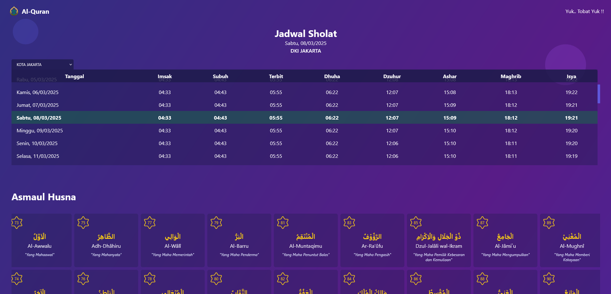

# Quran PHP

Daftar lengkap surat dalam Al-Qur\'an, Doa Harian, Asmaul Husna, dan Jadwal Sholat.

### Penginstalan

```
git clone https://github.com/fitri-hy/quran-php.git
cd quran-php
composer install
composer dump-autoload
npm install
```

### Menjalankan

```
npm start

// atau

npm run live
```

